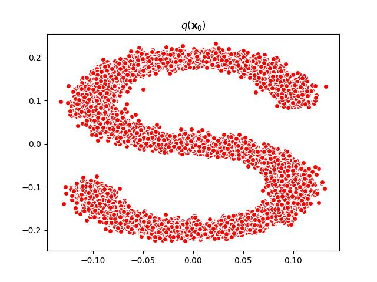
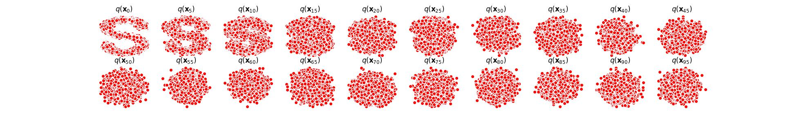

# 引言

对扩散模型[Denoising Diffusion Probabilistic Models](https://arxiv.org/abs/2006.11239)一个简单的复现，学习“S”点集的分布。

# 环境

```
scikit-learn     1.1.2
torch            1.11.0+cu113
python           3.8
matplotlib       3.5.1
```

# 可视化

注意，该版本仅支持 GPU 运行。

训练数据可视化：

```
python dataset.py
```

将显示将要学习的点集分布，也是我们的训练数据集：



扩散过程可视化：

```
python utils.py
```

显示正向扩散过程 $q(x_t|x_0)$ 的图示：



# 训练

超参数设置在 option.py 中，训练指令如下：

```
python train.py
```

训练的中间可视化结果保存在目录 checkpoints_dir/name 下，每训练 fig_save_freq 代保存一次反向扩散的预测图示，如下图是训练 3900 代后的分布拟合结果：


